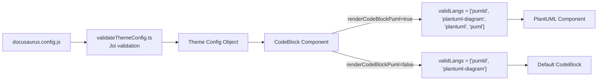

# Design Document

## Overview
### en
1. This design describes the implementation of the `renderCodeBlockPuml` configuration flag for `docusaurus-theme-plantuml`
1. The flag controls whether `plantuml` and `puml` language keywords trigger PlantUML diagram rendering in code fence blocks
1. The change touches four files: theme config validation, TypeScript type definitions, the CodeBlock component, and validation tests
1. The flag defaults to `false` to preserve backward compatibility

### ja
1. 本設計は、`docusaurus-theme-plantuml`における`renderCodeBlockPuml`設定フラグの実装を記述する
1. このフラグは、コードフェンスブロックで`plantuml`および`puml`言語キーワードがPlantUMLダイアグラムレンダリングをトリガーするかどうかを制御する
1. 変更対象は4ファイル: テーマ設定バリデーション、TypeScript型定義、CodeBlockコンポーネント、バリデーションテスト
1. 後方互換性を維持するため、フラグのデフォルト値は`false`とする

## Architecture
### en
1. The change is minimal and localized within the existing architecture
1. No new components or modules are introduced
1. The data flow is: `docusaurus.config.js` -> Joi validation (`validateThemeConfig.ts`) -> theme config object -> `CodeBlock` component reads `renderCodeBlockPuml` via `useThemeConfig()` -> conditionally extends `validLangs` array

### ja
1. 変更は最小限で、既存のアーキテクチャ内に局所化される
1. 新しいコンポーネントやモジュールは導入しない
1. データフロー: `docusaurus.config.js` -> Joiバリデーション(`validateThemeConfig.ts`) -> テーマ設定オブジェクト -> `CodeBlock`コンポーネントが`useThemeConfig()`経由で`renderCodeBlockPuml`を読み取り -> `validLangs`配列を条件付きで拡張



## Components and Interfaces
### en
1. `src/validateThemeConfig.ts`: Add `renderCodeBlockPuml: false` to `DEFAULT_THEME_CONFIG.plantuml` and add `Joi.boolean().optional().default(false)` to `plantumlSchema`
1. `src/theme-plantuml.d.ts`: Add optional `renderCodeBlockPuml?: boolean` property with JSDoc to `PlantumlConfig` interface
1. `src/theme/CodeBlock/index.tsx`: Read `renderCodeBlockPuml` from theme config via `useThemeConfig()` and conditionally append `'plantuml'` and `'puml'` to the valid languages list
1. `src/__tests__/validateThemeConfig.test.js`: Add tests for default value, `true` value, and `false` value of `renderCodeBlockPuml`

### ja
1. `src/validateThemeConfig.ts`: `DEFAULT_THEME_CONFIG.plantuml`に`renderCodeBlockPuml: false`を追加し、`plantumlSchema`に`Joi.boolean().optional().default(false)`を追加する
1. `src/theme-plantuml.d.ts`: `PlantumlConfig`インターフェースにJSDoc付きのオプション`renderCodeBlockPuml?: boolean`プロパティを追加する
1. `src/theme/CodeBlock/index.tsx`: `useThemeConfig()`経由でテーマ設定から`renderCodeBlockPuml`を読み取り、有効な言語リストに条件付きで`'plantuml'`と`'puml'`を追加する
1. `src/__tests__/validateThemeConfig.test.js`: `renderCodeBlockPuml`のデフォルト値、`true`値、`false`値のテストを追加する

### Interface Changes

`PlantumlConfig` (in `src/theme-plantuml.d.ts`):

```typescript
export interface PlantumlConfig {
    /** Server URL for light mode */
    serverUrlLight: string;
    /** Server URL for dark mode */
    serverUrlDark: string;
    /** debug mode */
    debug?: boolean;
    /** Whether to render `plantuml` and `puml` code blocks as PlantUML diagrams. Defaults to `false`. */
    renderCodeBlockPuml?: boolean;
}
```

### CodeBlock Component Change

```typescript
// src/theme/CodeBlock/index.tsx
import { useThemeConfig } from '@docusaurus/theme-common';
import type { ThemeConfig } from '../../theme-plantuml';

const baseValidLangs = ['pumld', 'plantuml-diagram'];

export default function CodeBlock({ children: rawChildren, ...props }: Props): ReactNode {
    const docusaurusThemeConfig = useThemeConfig();
    const { plantuml }: ThemeConfig = docusaurusThemeConfig as ThemeConfig;
    const validLangs = plantuml?.renderCodeBlockPuml
        ? [...baseValidLangs, 'plantuml', 'puml']
        : baseValidLangs;
    // ... rest of component
}
```

### Validation Schema Change

```typescript
// src/validateThemeConfig.ts
export const DEFAULT_THEME_CONFIG = {
    plantuml: {
        serverUrlLight: 'https://www.plantuml.com/plantuml/svg/',
        serverUrlDark: 'https://www.plantuml.com/plantuml/dsvg/',
        debug: false,
        renderCodeBlockPuml: false,
    },
};

const plantumlSchema = Joi.object({
    serverUrlLight: Joi.string().optional().default(DEFAULT_THEME_CONFIG.plantuml.serverUrlLight),
    serverUrlDark: Joi.string().optional().default(DEFAULT_THEME_CONFIG.plantuml.serverUrlDark),
    debug: Joi.boolean().optional().default(DEFAULT_THEME_CONFIG.plantuml.debug),
    renderCodeBlockPuml: Joi.boolean().optional().default(DEFAULT_THEME_CONFIG.plantuml.renderCodeBlockPuml),
});
```

## Data Models
### en
1. No new data models are introduced
1. The existing `PlantumlConfig` interface gains one optional boolean field: `renderCodeBlockPuml`
1. The `DEFAULT_THEME_CONFIG` object gains one field: `plantuml.renderCodeBlockPuml: false`
1. The Joi validation schema gains one field: `renderCodeBlockPuml: Joi.boolean().optional().default(false)`

### ja
1. 新しいデータモデルは導入しない
1. 既存の`PlantumlConfig`インターフェースにオプションのbooleanフィールド`renderCodeBlockPuml`を1つ追加する
1. `DEFAULT_THEME_CONFIG`オブジェクトにフィールド`plantuml.renderCodeBlockPuml: false`を1つ追加する
1. Joiバリデーションスキーマにフィールド`renderCodeBlockPuml: Joi.boolean().optional().default(false)`を1つ追加する

## Correctness Properties

*A property is a characteristic or behavior that should hold true across all valid executions of a system-essentially, a formal statement about what the system should do. Properties serve as the bridge between human-readable specifications and machine-verifiable correctness guarantees.*

### en
1. Two properties are identified from the acceptance criteria prework analysis
1. Most acceptance criteria are EXAMPLE-type tests due to the small input space (boolean flag with 3 states: true, false, absent)
1. The properties below focus on validation schema correctness

### ja
1. 受け入れ基準のプレワーク分析から2つのプロパティが特定された
1. 入力空間が小さい(booleanフラグの3状態: true, false, 未指定)ため、ほとんどの受け入れ基準はEXAMPLE型テストである
1. 以下のプロパティはバリデーションスキーマの正確性に焦点を当てる

### Property 1: Non-boolean values are rejected or coerced by validation

*For any* value that is not a boolean provided as `renderCodeBlockPuml`, the Joi validation schema SHALL either reject the value with a validation error or coerce it to a boolean according to Joi's standard coercion rules.

**Validates: Requirements 1.3**

### Property 2: Existing configs without renderCodeBlockPuml remain valid with default applied

*For any* valid existing configuration object containing `serverUrlLight` (string), `serverUrlDark` (string), and `debug` (boolean) but without `renderCodeBlockPuml`, the validation SHALL succeed and the output SHALL include `renderCodeBlockPuml` equal to `false` while preserving all other provided values.

**Validates: Requirements 3.3, 1.2**

## Error Handling
### en
1. When `renderCodeBlockPuml` is provided with a non-boolean value, Joi validation will reject the configuration with a validation error at Docusaurus startup
1. This is standard Docusaurus theme config validation behavior - no custom error handling is needed
1. The `CodeBlock` component uses optional chaining (`plantuml?.renderCodeBlockPuml`) to safely handle cases where the plantuml config object is undefined

### ja
1. `renderCodeBlockPuml`にboolean以外の値が提供された場合、JoiバリデーションがDocusaurus起動時にバリデーションエラーで設定を拒否する
1. これは標準的なDocusaurusテーマ設定バリデーションの動作であり、カスタムエラーハンドリングは不要
1. `CodeBlock`コンポーネントはオプショナルチェーン(`plantuml?.renderCodeBlockPuml`)を使用して、plantuml設定オブジェクトがundefinedの場合を安全に処理する

## Testing Strategy
### en
1. Testing uses `node:test` and `node:assert/strict` (existing test framework in the project)
1. No additional test dependencies are required
1. Property-based testing is applicable but with limited value due to the small input space of a single boolean config flag
1. The primary testing approach is example-based unit tests for validation behavior

### ja
1. テストは`node:test`と`node:assert/strict`を使用する(プロジェクト既存のテストフレームワーク)
1. 追加のテスト依存関係は不要
1. プロパティベーステストは適用可能だが、単一のboolean設定フラグという小さな入力空間のため価値は限定的
1. 主要なテストアプローチはバリデーション動作のexampleベースユニットテスト

### Unit Tests (in `src/__tests__/validateThemeConfig.test.js`)
### en
1. Test that `renderCodeBlockPuml` defaults to `false` when not provided (validates 1.2, 5.1)
1. Test that `renderCodeBlockPuml: true` is accepted and preserved (validates 1.1, 5.2)
1. Test that `renderCodeBlockPuml: false` is accepted and preserved (validates 1.1, 5.3)

### ja
1. `renderCodeBlockPuml`が提供されない場合にデフォルト値`false`になることをテスト(1.2, 5.1を検証)
1. `renderCodeBlockPuml: true`が受け入れられ保持されることをテスト(1.1, 5.2を検証)
1. `renderCodeBlockPuml: false`が受け入れられ保持されることをテスト(1.1, 5.3を検証)

### Property-Based Tests
### en
1. If property-based testing is adopted, use a lightweight PBT library such as `fast-check` for Node.js
1. Minimum 100 iterations per property test
1. Tag format: `Feature: #00019-plantuml-lang-keywords, Property {number}: {property_text}`
1. Property 1: Generate random non-boolean values and verify Joi rejects or coerces them
1. Property 2: Generate random valid existing configs and verify renderCodeBlockPuml defaults to false

### ja
1. プロパティベーステストを採用する場合、Node.js用の軽量PBTライブラリ(例: `fast-check`)を使用する
1. プロパティテストごとに最低100回のイテレーション
1. タグ形式: `Feature: #00019-plantuml-lang-keywords, Property {number}: {property_text}`
1. Property 1: ランダムな非boolean値を生成し、Joiが拒否またはcoerceすることを検証
1. Property 2: ランダムな有効な既存設定を生成し、renderCodeBlockPumlがデフォルトでfalseになることを検証

### Manual Verification
### en
1. Verify that `plantuml` and `puml` code blocks render as PlantUML diagrams when `renderCodeBlockPuml: true` (validates 2.1, 2.3, 2.4)
1. Verify that `plantuml` and `puml` code blocks render as standard code blocks when `renderCodeBlockPuml: false` or absent (validates 2.2, 3.2)
1. Verify that `pumld` and `plantuml-diagram` code blocks continue to render as PlantUML diagrams regardless of the flag (validates 3.1)
1. Verify TypeScript compilation succeeds with the updated type definitions (validates 4.1, 4.2)

### ja
1. `renderCodeBlockPuml: true`の場合、`plantuml`と`puml`コードブロックがPlantUMLダイアグラムとしてレンダリングされることを確認(2.1, 2.3, 2.4を検証)
1. `renderCodeBlockPuml: false`または未指定の場合、`plantuml`と`puml`コードブロックが標準コードブロックとしてレンダリングされることを確認(2.2, 3.2を検証)
1. フラグに関係なく、`pumld`と`plantuml-diagram`コードブロックが引き続きPlantUMLダイアグラムとしてレンダリングされることを確認(3.1を検証)
1. 更新された型定義でTypeScriptコンパイルが成功することを確認(4.1, 4.2を検証)
