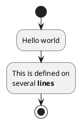

# docusaurus-theme-plantuml

plugin for displaying plantuml in docusaurus.

[](#)

[](https://www.npmjs.com/package/docusaurus-theme-plantuml)

## What is this?
### en
1. this is a theme for displaying plantuml diagrams on docusaurus.
    1. at first, I tried to make it as a plugin, but it did not work, so I made it as a theme
1. the default setting is to display the results rendered by the plantuml server via https communication.

### jp
1. これはdocusaurusにplantumlの図を表示するためのテーマです
    1. 最初、pluginとして作ろうとしましたがうまくいかなかったのでテーマとして作っています
1. デフォルト設定ではhttps通信でplantuml serverにレンダリングさせた結果を表示します

## How to Use?
### install

```sh
pnpm add docusaurus-theme-plantuml
```

or

```sh
npm install plugin-docusaurus-plantuml
```

or

```sh
yarn add plugin-docusaurus-plantuml
```


### How to set up on docusaurus

docusaurus.config.js

```js
module.exports = {
  // ...other settings
  themes: [
    require.resolve('docusaurus-theme-plantuml'),
  ]
};
```

### Example of description in markdown

```pumld
@startuml
Alice -> Bob: Hello
@enduml
```

or



#### en
1. If you want to display PlantUML code as markdown, you can also render it in the following cases instead of “plantuml” of prism.
    1. `plantuml-diagram`
    1. `pumld`

#### jp
1. markdownとしてPlantUMLのコードを表示したい場合も考慮してprismの「plantuml」ではなく、以下の場合にレンダリングする
    1. `plantuml-diagram`
    1. `pumld`

### Then build your Docusaurus project

```sh
pnpm run build
```

or

```sh
npm run build
```

or

```sh
yarn run build
```

## Options available

| Option           | Type      | Default                                   | Description               |
| ---------------- | --------- | ----------------------------------------- | ------------------------- |
| `serverUrlLight` | `string`  | `https://www.plantuml.com/plantuml/svg/`  | Server URL for light mode |
| `serverUrlDark`  | `string`  | `https://www.plantuml.com/plantuml/dsvg/` | Server URL for dark mode  |

### en
1. Default is to render to SVG format on plantuml official server
1. For example, if you want to render in png format, do the following

### jp
1. デフォルトはplantuml公式のサーバーでSVG形式にレンダリングする
1. 例えばpng形式でレンダリングしたければ以下のようにする

```js
module.exports = {
  // ...other settings
  themeConfig: [
    plantuml: {
        serverUrlLight: 'https://www.plantuml.com/plantuml/png/',
        serverUrlDark: 'https://www.plantuml.com/plantuml/dpng/',
    },
  ],
};
```

## Changelog
Checkout the [releases](https://github.com/plenarc/docusaurus-theme-plantuml/releases) page for changelog.
