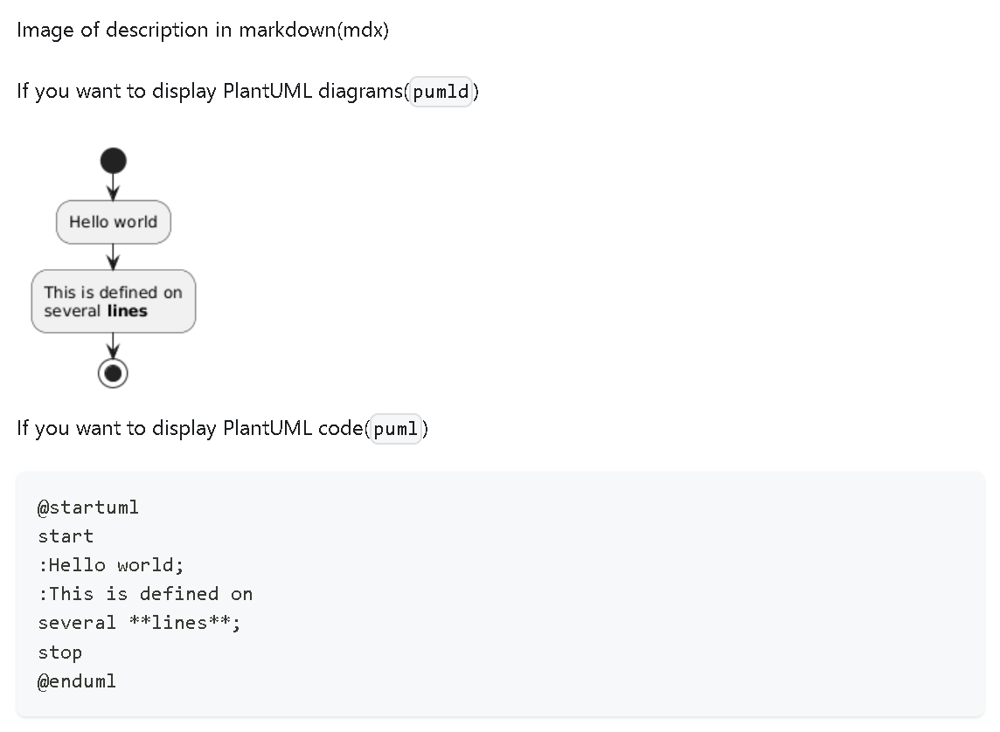
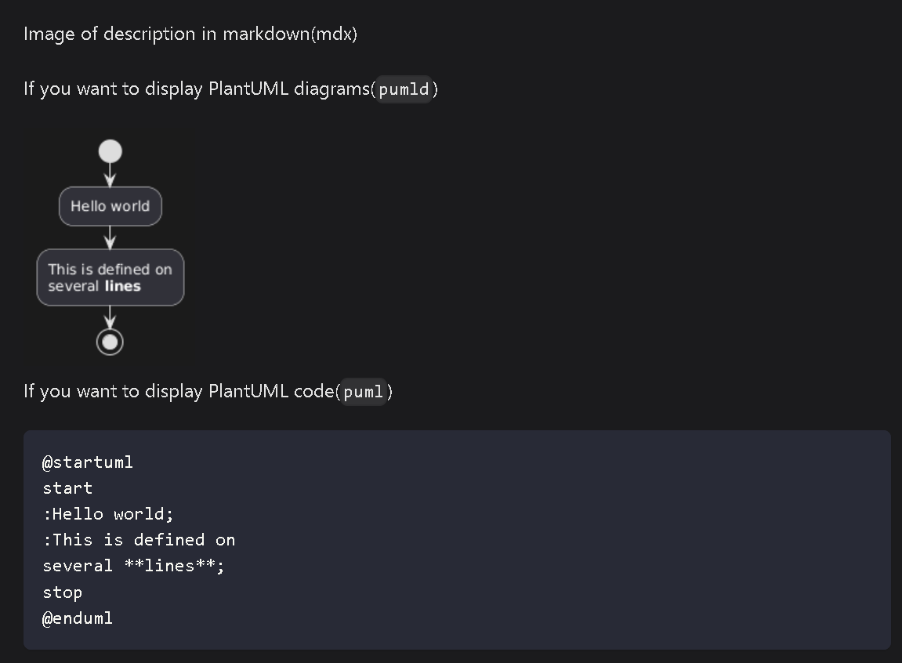

# docusaurus-theme-plantuml


Theme for displaying PlantUML in docusaurus.

[![npm version][npm-image]][npm-url]
[![npm downlads][npm-downloads-image]][npm-url]
[![License][license-image]][license-url]

## What is this?
### en
1. this is a theme for displaying plantuml diagrams on docusaurus.
    1. at first, I tried to make it as a plugin, but it did not work, so I made it as a theme
1. the default setting is to display the results rendered by the plantuml server via https communication.

### ja
1. これはdocusaurusにplantumlの図を表示するためのテーマです
    1. 最初、pluginとして作ろうとしましたがうまくいかなかったのでテーマとして作っています
1. デフォルト設定ではhttps通信でplantuml serverにレンダリングさせた結果を表示します

## image
1. light mode
    1. 
1. dark mode
    1. 

## Precautions before use
### en
1. The default rendering destination is the official PlantUML server.
1. Even though it is official, rendering is done via http, so if you handle confidential information, please set up your own server, etc., and use at your own risk.
1. see below
    1. plantuml.com/en/faq - https://plantuml.com/en/faq
        1. How long do the images generated by PlantUML Server live for?

### ja
1. デフォルトのレンダリング先はPlantUML公式のサーバーです。
1. 公式とはいえ、httpを介してレンダリングしているので、機密情報を扱う場合には自分でサーバーを立てるなどして、自己責任のうえ活用してください。
1. 以下を参照
    1. plantuml.com/ja/faq - https://plantuml.com/ja/faq
        1. PlantUML Serverで生成した画像はいつまで保持されますか?

## How to Use?
### install

```bash
pnpm add docusaurus-theme-plantuml
```

or

```bash
npm install plugin-docusaurus-plantuml
```

or

```bash
yarn add plugin-docusaurus-plantuml
```

### How to set up on docusaurus

docusaurus.config.js

```js
module.exports = {
  // ...other settings
  themes: [
    require.resolve('docusaurus-theme-plantuml'),
  ]
};
```

### Example of description in markdown

```markdown
    ## plantuml example

    ```pumld
    @startuml
    Alice -> Bob: Hello
    @enduml
    ```

    or

    ```plantuml-diagram
    @startuml
    start
    :Hello world;
    :This is defined on
    several **lines**;
    stop
    @enduml
    ```
```

#### en

1. We also take into account the case where you want to display PlantUML code as markdown and not “plantuml” to render it when
    1. `plantuml-diagram`
    1. `pumld`

#### ja

1. markdownとしてPlantUMLのコードを表示したい場合も考慮して「plantuml」ではなく、以下の場合にレンダリングするようにしています。
    1. `plantuml-diagram`
    1. `pumld`

### Then build your Docusaurus project

```sh
pnpm run build
```

or

```sh
npm run build
```

or

```sh
yarn run build
```

## Options available

| Option           | Type      | Default                                   | Description               |
| ---------------- | --------- | ----------------------------------------- | ------------------------- |
| `serverUrlLight` | `string`  | `https://www.plantuml.com/plantuml/svg/`  | Server URL for light mode |
| `serverUrlDark`  | `string`  | `https://www.plantuml.com/plantuml/dsvg/` | Server URL for dark mode  |
| `debug`          | `boolean` | `false`                                   | Turn on debug log output  |

### en
1. by default, the official PlantUML server renders the image in SVG format
1. docker is recommended if you want to prepare your own PlantUML server. specify its server URL as `serverUrlLight` etc.
    1. reference: dockerhub - https://hub.docker.com/r/plantuml/plantuml-server
1. for example, if you want to render in PNG format, configure as follows

### ja
1. デフォルトはPlantUML公式のサーバーでSVG形式にレンダリングしています
1. 自分でPlantUMLサーバーを用意するのであればdockerがオススメです。そのサーバーURLを`serverUrlLight`などに指定してください
    1. 参考: dockerhub - https://hub.docker.com/r/plantuml/plantuml-server
1. 例えばPNG形式でレンダリングしたければ以下のように設定します

```js
module.exports = {
  // ...other settings
  themeConfig: [
    plantuml: {
      serverUrlLight: 'https://www.plantuml.com/plantuml/png/',
      serverUrlDark: 'https://www.plantuml.com/plantuml/dpng/',
    },
  ],
};
```

- Note that the destination is `themeConfig`, not `themes`.
- 設定先が `themes` ではなく、 `themeConfig` であることに注意してください

## Compatibility
### en
1. This theme is compatible with Docusaurus v3.9.2 and later versions
1. Tested with Node.js 18.x and later
1. Package manager: pnpm (recommended), npm, or yarn

### ja
1. このテーマはDocusaurus v3.9.2以降のバージョンに対応しています
1. Node.js 18.x以降でテスト済み
1. パッケージマネージャー: pnpm(推奨)、npm、またはyarn

## Troubleshooting
### npm configuration warnings
#### en
1. If you encounter warnings like "Unknown env config" when running pnpm commands, check your `.npmrc` files
1. Common deprecated settings that cause warnings:
    1. `verify-deps-before-run` - This setting is deprecated and should be removed
    1. `_jsr-registry` - This setting is no longer supported
1. Solution:
    1. Check for `.npmrc` files in both project root and user home directory (`~/.npmrc`)
    1. Remove or comment out deprecated settings
    1. Run `pnpm run format` again to verify warnings are resolved

#### ja
1. pnpmコマンド実行時に「Unknown env config」のような警告が表示される場合、`.npmrc`ファイルを確認してください
1. 警告の原因となる一般的な非推奨設定:
    1. `verify-deps-before-run` - この設定は非推奨のため削除してください
    1. `_jsr-registry` - この設定はサポートされなくなりました
1. 解決方法:
    1. プロジェクトルートとユーザーホームディレクトリ(`~/.npmrc`)の両方で`.npmrc`ファイルを確認
    1. 非推奨設定を削除またはコメントアウト
    1. `pnpm run format`を再実行して警告が解消されたことを確認

### Biome configuration issues
#### en
1. If formatting or linting fails, verify your `biome.jsonc` configuration file
1. Common issues:
    1. Invalid JSON syntax in configuration file
    1. Missing or incorrect formatter settings
    1. Incompatible rule configurations
1. Solution:
    1. Validate JSON syntax using a JSON validator
    1. Check Biome documentation for correct configuration format
    1. Run `pnpm run lint` to identify specific configuration problems

#### ja
1. フォーマットやリントが失敗する場合、`biome.jsonc`設定ファイルを確認してください
1. よくある問題:
    1. 設定ファイルの無効なJSON構文
    1. フォーマッター設定の欠落または誤り
    1. 互換性のないルール設定
1. 解決方法:
    1. JSONバリデーターを使用して構文を検証
    1. Biomeドキュメントで正しい設定フォーマットを確認
    1. `pnpm run lint`を実行して具体的な設定問題を特定

### Build or test failures
#### en
1. If build or test commands fail after updating dependencies:
    1. Clear node_modules and reinstall: `rm -rf node_modules && pnpm install`
    1. Clear build cache: `rm -rf lib && pnpm run build`
    1. Verify TypeScript configuration is compatible with updated dependencies
    1. Check for breaking changes in dependency changelogs
1. For persistent issues, check the [issues](https://github.com/plenarc/docusaurus-theme-plantuml/issues) page or create a new issue

#### ja
1. 依存関係更新後にビルドやテストコマンドが失敗する場合:
    1. node_modulesをクリアして再インストール: `rm -rf node_modules && pnpm install`
    1. ビルドキャッシュをクリア: `rm -rf lib && pnpm run build`
    1. TypeScript設定が更新された依存関係と互換性があることを確認
    1. 依存関係の変更履歴で破壊的変更を確認
1. 問題が解決しない場合は、[issues](https://github.com/plenarc/docusaurus-theme-plantuml/issues)ページを確認するか、新しいissueを作成してください

## Changelog
Checkout the [releases](https://github.com/plenarc/docusaurus-theme-plantuml/releases) page for changelog.

[npm-image]: https://img.shields.io/npm/v/docusaurus-theme-plantuml.svg
[npm-url]: https://www.npmjs.com/package/docusaurus-theme-plantuml
[npm-downloads-image]: https://img.shields.io/npm/dw/docusaurus-theme-plantuml.svg
[license-image]: https://img.shields.io/github/license/plenarc/docusaurus-theme-plantuml.svg
[license-url]: https://github.com/plenarc/docusaurus-theme-plantuml/blob/main/LICENSE
